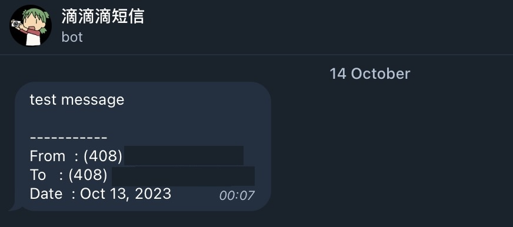

# numberbarn2telegram

这是一个cloudflare email workers,能够将numberbarn的短信邮件转换成telegram消息。



### 配置

|  KEY    |  描述   |
| ---- | ---- |
| TELEGRAM_ID |   你的Telegram ID   |
|   TELEGRAM_TOKEN   | Telegram Bot Token |
| EMAIL_WHITELIST  |   numberbarn 邮件白名单默认留空则使用`voicemail@numberbarn.com` ，以后要是有变动可以不修改代码直接修改环境变量，可以填入多个使用`,`分隔。   |
| BACKUP_EMAIL | 备份邮件，可以转发到自己的邮箱备份, 留空则不转发 |
| BLOCK_NOTIFY | 屏蔽号码的范围, 默认值为空只屏蔽Telegram, 可选项: `all`,`telegram`,`mail` |


### 命令

| Command       | 描述                 |
| ------------- | -------------------- |
| /blocks       | 获取被屏蔽的号码列表 |
| /block <id>   | 屏蔽一个号码         |
| /unblock <id> | 取消屏蔽一个号码     |

> 这里屏蔽的号码通知范围由`BLOCK_NOTIFY`决定

### 部署

```shell
git clone git@github.com:TBXark/numberbarn2telegram.git

# 复制配置模板，修改成自己的telegram配置
cp wrangler.example.toml wrangler.toml 

# 部署👇
yarn & yarn pub

# 完成Telegram绑定
curl https://numberbarn2telegram.yourname.workers.dev/init 
```


### 项目来源

作为Google Voice的老用户，时常担心自己的号码被回收。Google的政策实在是很迷惑，最近有认识的人在没有预警的情况下号码被回收了。所以想把号码转出去，但是实体卡担心SIM卡损坏补卡的问题，esim的话还得另外买一部平时用不上的手机。

最后选择号码转到了numberbarn，这也是一个类似google voice的平台但是不是免费的。从Google Voice转出需要3U的解锁费用，然后numberbarn转入需要收取5U的一个费用，然后他们家最低的保号套餐是2U一个月。有一说一还是挺贵的。PS：现在google voice不支持虚拟号转入，所以你转到numberbarn后想回去是不行的，必须借助一张实体卡中转。

但是numberbarn的网站和APP都太复古了，实在是不想用。连邮件也是丑丑的不想打开。这个号码基本只是收验证码，没有发短信或者接打电话的需求。所以我可以跟简单的借助Cloudflare推出的[`Email Routing`](https://developers.cloudflare.com/email-routing/), 就可以对邮件进行读取之后转发到telegram里了。
